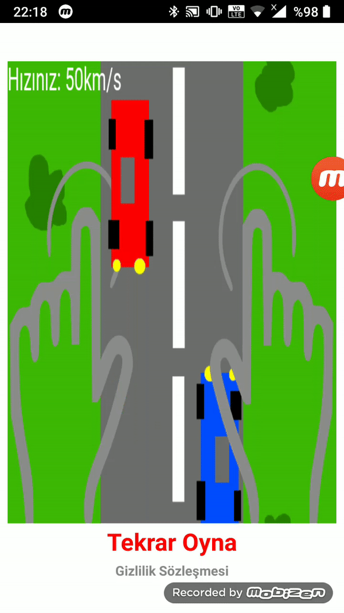

### Hızlanan arabalar oyunu

Phaser 3 ile ikinci oyun denemesi

**Kullanılanlar**

`Phaser.Scene.input.on()`
` Phaser.Game`
`Phaser.Scene`
`add.tileSprite()`
`this.func()`

İlk kodlamadan hızlı olmasının sebebi, yol çizglileri geometri değik şekil değil, yol ile birlikte resim ve tile  sprite olarak akıyor.
Araç uçlarıbelli hizağıya geldiği zaman diğeriyle aynı şeritte olu olmadığına bakılır:

   `Carpis_bak(){
      // if both cars are in the same side

      if (this.__araba.x == this.__diger_obj.x){

        this.__arac_uc = this.__araba.y - (234/2);

        if (this.__arac_uc <= this.__diger_uc){

          this.__tmp_say++;

          this.scene.start("scene2");

        //  console.log("carpar   " + this.__tmp_say);

        }

      }

    }`

###[YouTube'de izle:   ](https://youtu.be/GzwI_U4WD0Y "Link")
